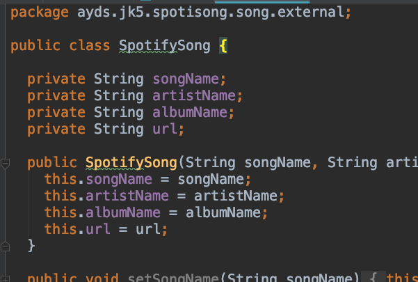

# Pasos para mover un paquete del proyecto a un submódulo

- Crear el repositorio del submódulo. Agregar un readme (el repositorio del submódulo no puede estar vacío al agregarlo al repositorio del proyecto).

- Agregar el submódulo:

git submodule add git@github.com:elagarrigue/AyDS-JSubModuleSpotifyData.git libs/SpotifyData

- En el proyecto de IntelliJ, crear un nuevo módulo (android library).

- Seleccionen la carpeta del submódulo.

- Actualizar el .gitignore del submódule (copiar el mismo que el del proyecto base). Hacer commit y push del submódulo y del proyecto.

- Crear en el módulo un paquete con nombre relevante.

- Mover el paquete “external” de model al módulo.

- El nuevo módulo tiene ahora referencias a retrofit y gson. COPIAR esas dependencias de app/build.gradle a libs/SpotifyData/build.gradle.
Nota: moverlas debería ser suficiente, pero al sacarlas no exporta las librerías en el assemble y tira error en runtime.

- El proyecto va a dejar de compilar, ya que el código de external no lo tenemos más. 

- Lo primero que hay que hacer es agregar la dependencia del nuevo módulo vía gradle. 

- Es necesario agregar el include en settings

- Además, hace falta agregar la depencia en Module Settings. 
Nota: Esto debería poder hacerse via gradle mediante ‘compile project’ pero no está funcionando. Dado que lo siguiente modifica archivos del ide ignorados en el repo, hay q agregarlo en cada copia local.

- Si external no era independiente (tenia referencias por fuera del paquete), el modulo no va a compilar. 

- En este caso, tenemos que implementar nuestra propia clase (una copia de Song), y luego hacer la conversión en Repository.

- Hacer Clean, build, run. Una vez que compile y ejecute correctamente hacer commit y push del repo del submódulo, y del proyecto. 

